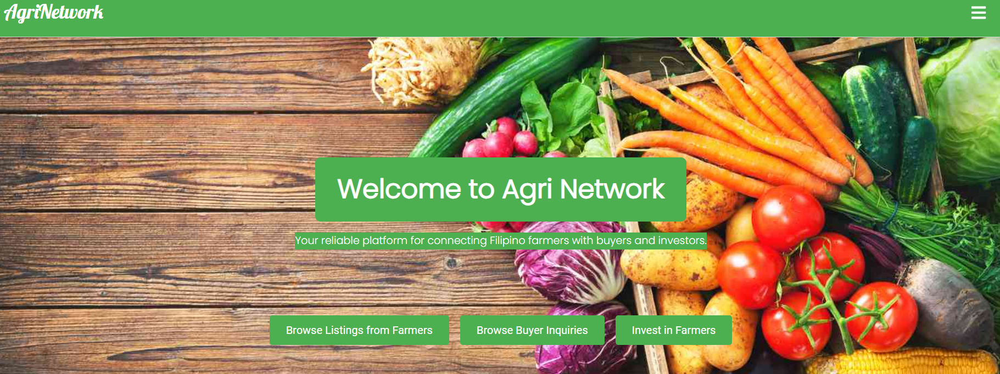
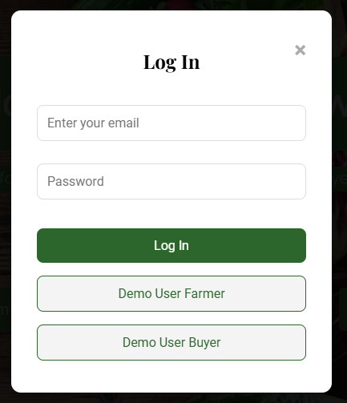
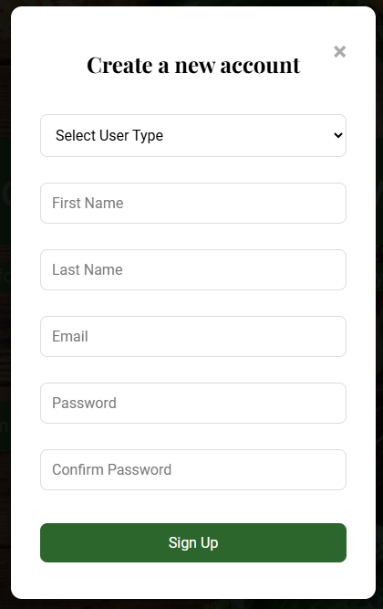
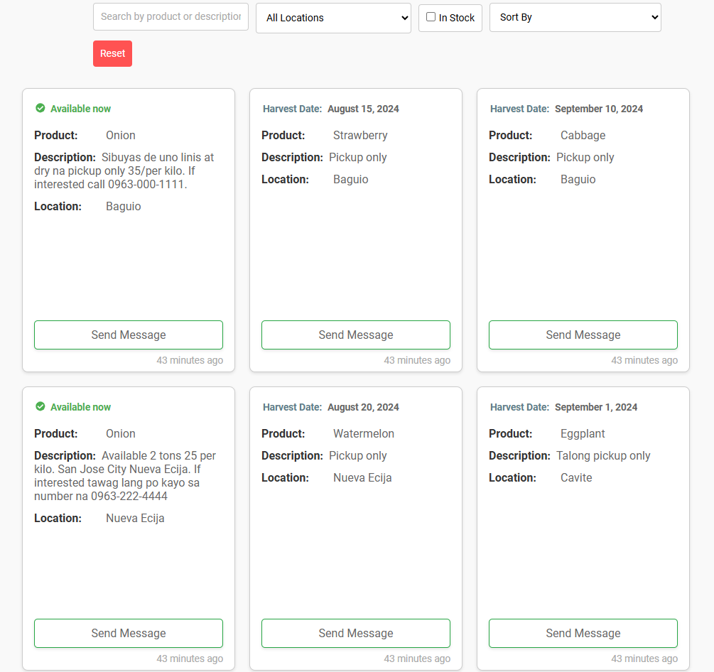
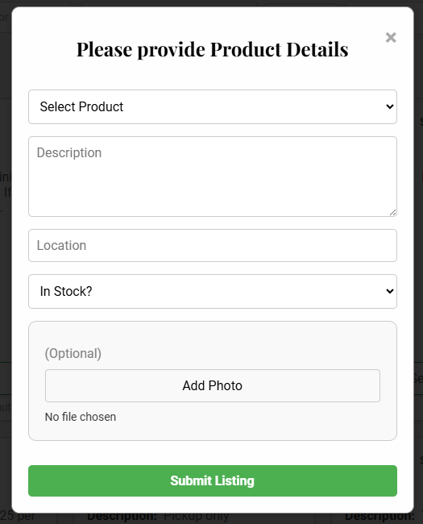
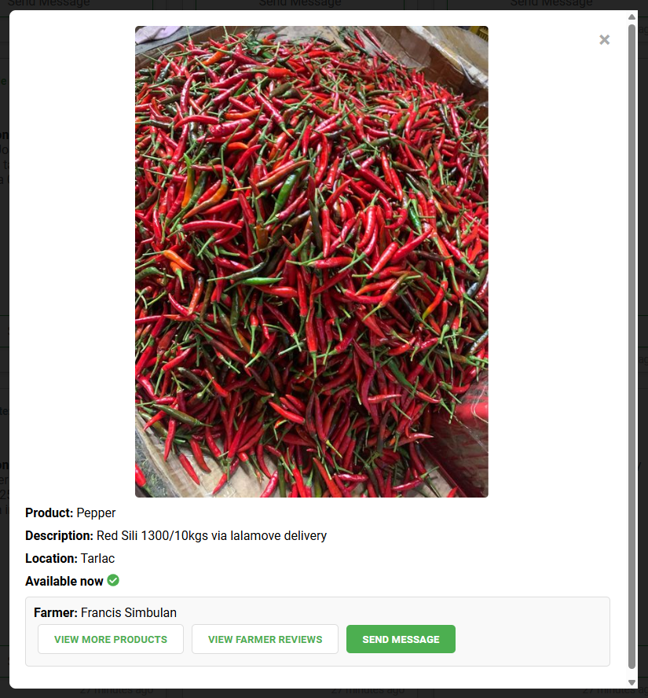

# Agri Network

Agri Network is a web application designed to connect farmers with buyers, facilitate the posting and browsing of agricultural listings, and provide a platform for investment opportunities. This project aims to streamline agricultural trade and support Filipino farmers by leveraging modern web technologies.

## Live Site

- [Visit Agri Network](https://agri-network.onrender.com/)

## Screenshots

#### Home Page


#### Log In Modal


#### Sign Up Modal


#### Listing Page


#### Add New Product Listing


#### Product Details Modal



## Index

- [Feature List](docs/feature-list.md)
- [Database Schema](docs/database-schema.md)
- [Frontend Routes](docs/frontend-routes.md)
- [API Routes](docs/api-routes.md)

## Technologies Used

- **Front-End:** React, CSS
- **State Management:** Redux
- **Back-End:** Flask
- **Database:** SQLAlchemy
- **Cloud Storage:** AWS S3
- **Version Control:** Git


## Installation

To get a local copy up and running, follow these steps:

1. **Clone the Repository:**

   ```sh
   git clone https://github.com/hazelcaling/agri-network.git
   ```

2. **Navigate to the Project Directory:**

   ```sh
   cd agri-network
   ```

3. **Activate the virtual environment:**

   ```sh
   pipenv shell
   ```
4. **Install Dependencies:**

   ```sh
   pipenv install -r requirements.txt
   ```
5. **Set Up Environment Variables:**
   - Create `.env` file in the root directory of the project and add the following environment variables:

      ```sh
      # Secret key for Flask
      SECRET_KEY=your-secret-key

      # Database connection details
      DATABASE_URL=sqlite:///dev.db
      DATABASE_SCHEMA=your-database-schema

      # AWS S3 credentials
      AWS_ACCESS_KEY_ID=your-access-key-id
      AWS_SECRET_ACCESS_KEY=your-secret-access-key
      S3_BUCKET_NAME=your-s3-bucket-name
      ```

   - Create a `.flaskenv` file in the root directory of the project and add the following environment variables:

      ```sh
      FLASK_APP=app
      FLASK_DEBUG=true
      FLASK_RUN_PORT=8000
      ```


6. **Run Migrations:**

   ```sh
   flask db upgrade
   ```

7. **Seed the database:**

   ```sh
   flask seed all
   ```

8. **Set Up React Front-end:**
   - Navigate to the React front-end directory and install dependancies:

      ```sh
      cd react-vite
      npm install
      ```

   - Start the React development server:

      ```sh
      npm run dev
      ```


9. **Start the Development Server:**
   - Open a new terminal, navigate to the root directory, and run:

      ```sh
      flask run
      ```

10. **Access the Application:**
    - Open your browser and go to `http://127.0.0.1:8000` for the Flask backend and `http://localhost:5173/` for the React front-end.
